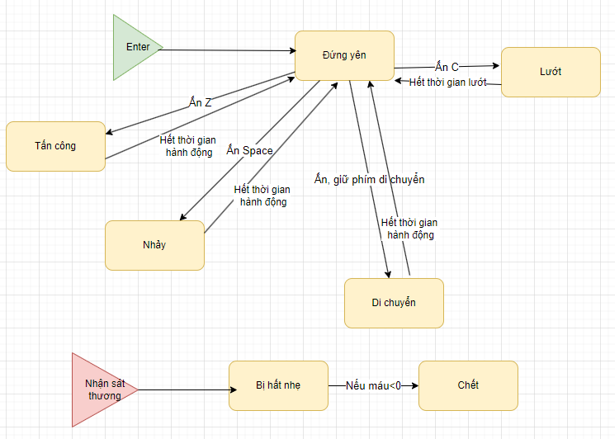
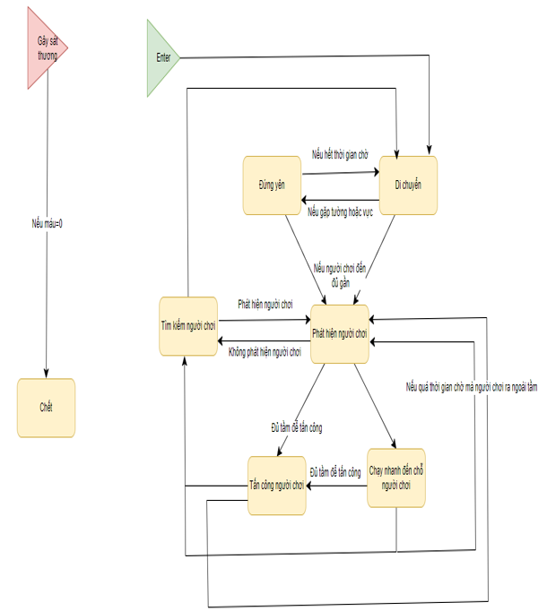
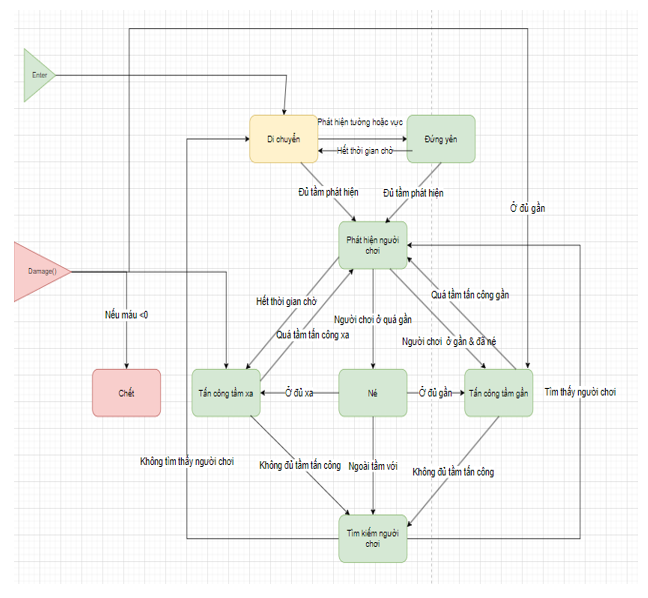
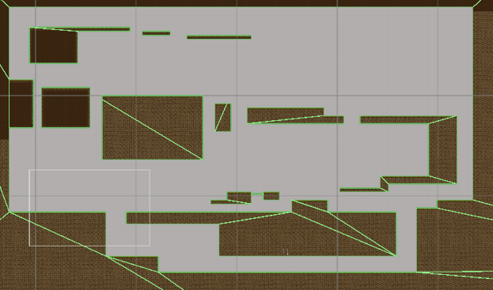
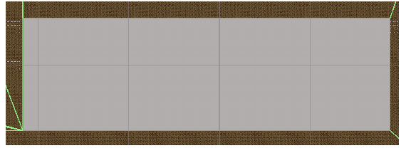

Game được xây dựng để phục vụ cho môn học Thực tập cơ sở
Bản dựng WebGL:
https://play.unity.com/en/games/8b067c38-18eb-4eee-94cc-b1acacf0f4d7/webgl-builds
Kẻ địch thường và Boss được xây dựng bằng State machine pattern, dư ảnh của nhân vật sau khi kĩ năng lướt được quản lý bằng Object Pooling pattern
State diagram của người chơi

State diagram của kẻ địch

State diagram của Boss

Map level 1 được xây dựng bằng tile map

Map level 2 được xây dựng bằng tile map
